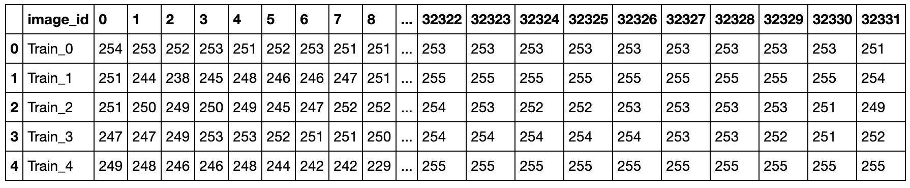
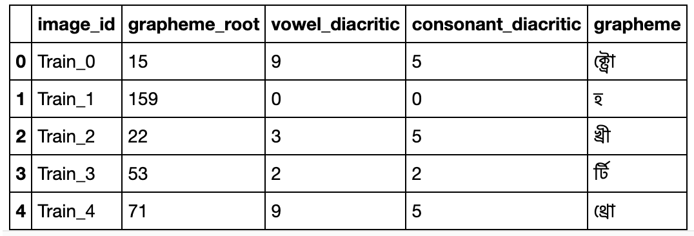

# [Intermediate, Computer Vision] Custom Image classification using Machine Learning on Amazon Sagemaker
---

## Introduction

머신 러닝 인프라, 기술, 그리고 툴킷의 발전으로, 이제 MNIST 99% accuracy는 머신 러닝의 Hello world가 되었습니다. 또한, 다양한 pre-trained model이 저장된 model zoo로 인해 훈련된 모델을 손쉽게 가져다가 쓸 수 있습니다.
하지만, 고객은 일반적인 문제가 아닌 multi-label에 대한 classification을 검토하고 있습니다. 
(1st label: 신선식품/가공식품, 2nd label: 소고기/돼지고기/닭고기, 3rd label: 안창살/갈비살)
여러분은 multi-label classification에 적합한 데이터셋 중, Kaggle의 Bangali.ai 손글씨 인식 데이터셋을 사용하여, custom 모델을 훈련하고 배포하는 PoC를 수행해야 합니다. 이 PoC가 성공적이라면 고객은 프로젝트 계약에 긍정적인 반응을 보일 것입니다.

## Mission

### Objective
팀의 목표는 Amazon Rekognition이나 Amazon SageMaker를 활용하여 Bangali.ai 손글씨 인식 모델을 훈련하고 배포하는 것입니다.

### 팀원 및 추천 서비스
- 팀원 중 적어도 1명은 컴퓨터 비전 프로젝트 경험이 있는 데이터 과학자나 머신 러닝 엔지니어가 포함되는 것을 권장하지만, 필수는 아닙니다.
- 추천 서비스
    - Amazon SageMaker BYOM(Bring Your Own Model); TensorFlow, PyTorch, MXNet

## About the Dataset

이 데이터셋은 137x236 해상도의 20여만 장의 훈련 데이터로 이루어져 있습니다.
참고로 JPG 파일들이 아니라 4개의 parquet 파일로 구성되어 있으며, 각 parquet 파일은 32,333개의 컬럼과 5만여 건의 레코드 (즉, 5만여 장의 이미지)로 구성되어 있습니다. 이 중 첫번째 컬럼인 `image_id` 컬럼은 Train Index로 `train.csv`에서 `image_id`를 참조하여 정답 레이블을 알 수 있습니다. 

 
 
 

데이터셋은 아래 웹사이트에서 다운로드받을 수 있습니다
- https://www.kaggle.com/c/bengaliai-cv19

(*Hint*: Kaggle의 Notebook이나 Discussion에 수많은 레퍼런스 코드와 팁들이 있습니다.)

## Get Started

### Starter Code
* Kaggle Baseline: https://www.kaggle.com/kaushal2896/bengali-graphemes-starter-eda-multi-output-cnn
* Building an end-to-end ML demo based on the PyTorch framework on Amazon SageMaker: https://github.com/daekeun-ml/end-to-end-pytorch-on-sagemaker

### Tips

#### Deployment
Amazon SageMaker를 사용하신다면 수많은 배포(deployment) 핸즈온들이 있습니다. 아래 핸즈온들을 검토해 보세요.

## References

* https://www.kaggle.com/c/bengaliai-cv19/

 

[Privacy](https://aws.amazon.com/privacy/) | [Site terms](https://aws.amazon.com/terms/) | © 2021, Amazon Web Services, Inc. or its affiliates. All rights reserved.